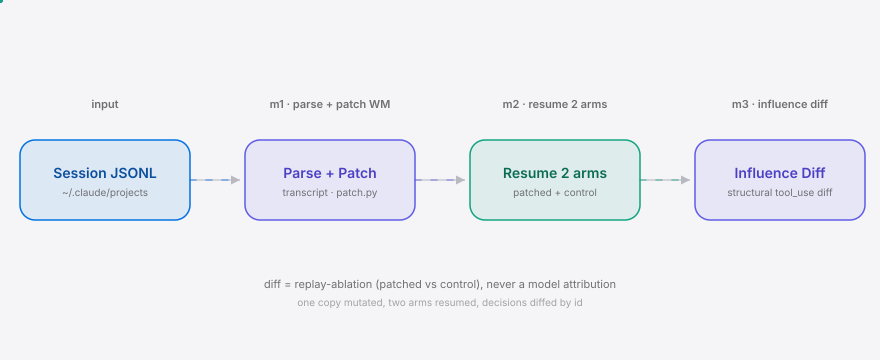

**English** | [简体中文](./README.md)

<div align="right"><sub><b>EN</b>&nbsp;&nbsp;⇄&nbsp;&nbsp;<a href="./README.md">中文</a></sub></div>

<picture>
  <source media="(prefers-color-scheme: dark)" srcset="./assets/hero-dark.svg">
  <source media="(prefers-color-scheme: light)" srcset="./assets/hero-light.svg">
  
</picture>

<p align="center"><sub>Patch a derailed coding agent's working memory mid-run, resume, and see which downstream decisions your patch changed.</sub></p>

<p align="center">
  <a href="./LICENSE"></a>
  <a href="https://github.com/SuperMarioYL/patchmem/releases"></a>
  
  
  
  
</p>

**In one line**: when a long coding-agent run goes sideways, don't "let it finish" or "restart from scratch" — patch its working memory, resume, and see which `tool_use` decisions the patch changed.

<h2> Architecture</h2>

<picture>
  <source media="(prefers-color-scheme: dark)" srcset="./assets/atlas-dark.svg">
  <source media="(prefers-color-scheme: light)" srcset="./assets/atlas-light.svg">
  
</picture>

PatchMem reads `~/.claude/projects/*/<session>.jsonl`, renders the parentUuid-linked decision tree and the current working memory as a rich TUI; the operator inserts a patch block (plan/scratchpad) at a chosen anchor point, then resume runs **both a patched arm and an unpatched control arm**, and a structural diff of the two arms' `tool_use` decisions yields a machine-checkable patch-influence-diff. One transcript copy is mutated, two arms are resumed, decisions are diffed by `id` — never a model attribution.

<h2> Why now</h2>

Coding-agent runs grew from a single-turn refactor into multi-hour long-horizon runs, and the probability of a derailment grows with length. Three things landed in the last ~6 months at once: long agentic runs became normal — the audience around coding agents like [headroomlabs-ai/headroom](https://github.com/headroomlabs-ai/headroom) is still compounding; runtimes started persisting structured, replayable state — the Claude Code session JSONL carries `parentUuid`-linked `tool_use` blocks with stable `id`s, exactly the diffable working-memory surface; and token/cache economics made restart expensive — a derailed long run now costs real money and cache state to throw away. Two years ago the WM was opaque prompt context; today it is a JSONL of typed blocks addressable by `id` for replay-ablation. PatchMem's owned primitive — a replay-ablation decision-diff — is only solvable now that the decision log is machine-addressable.

<h2> Install</h2>

```bash
# Option 1: uv tool (recommended, <60s, zero config)
uv tool install patchmem
# Option 2: pipx
pipx install patchmem
# Option 3: from source
git clone https://github.com/SuperMarioYL/patchmem && cd patchmem && pip install -e .
```

<h2> Quickstart</h2>

```bash
# 1. View the working memory + decision tree for any session (reads your own ~/.claude/projects)
patchmem view <session-id-prefix>

# 2. Open $EDITOR, author a working-memory patch, write patch.md (anchor verified)
patchmem edit <session-id-prefix>

# 3. (m2) Resume patched + control arms; (m3) read the influence diff
patchmem resume <session-id-prefix> --patch patch.md   # m2 — stub in v0.1
patchmem diff  <session-id-prefix>                     # m3 — primitive implemented, awaits m2 replay
```

<details><summary>Sample output (<code>patchmem view</code> on fixture)</summary>

```
patchmem v0.1.0  session: sample_session

╭──────────────────────────────────────────────────────────────────────────────╮
│ session  10 messages  4 tool_use decisions                                   │
╰──────────────────────────────────────────────────────────────────────────────╯
session
└── user      msg-0001  2026-08-17T09:00:01  (text only)
    └── assistant msg-0002  2026-08-17T09:00:05  tool_use [Bash]  id=toolu_aaaa0001
        └── user      msg-0003  ... tool_result
            └── assistant msg-0006  tool_use [Write]  id=toolu_aaaa0003
                └── ...
                    └── assistant msg-0010  Done. The auth middleware now validates HS256 JWTs ...

╭─────────────────────── working memory / plan ────────────────────────────────╮
│ [3] anchor=msg-0006  Now I will write a real JWT-backed auth middleware ...   │
│ [5] anchor=msg-0010  Done. The auth middleware now validates HS256 JWTs ...   │
╰──────────────────────────────────────────────────────────────────────────────╯

                              valid patch anchors
┏━━━━━━┳━━━━━━━━━━━━━┳━━━━━━━━━━━┳━━━━━━━━━━━━━━━━━━━━━━━━━━━━━━━━━━━━━━━━━━━━━┓
┃ #    ┃ anchor uuid ┃ type      ┃ preview                                     ┃
┡━━━━━━╇━━━━━━━━━━━━━╇━━━━━━━━━━━╇━━━━━━━━━━━━━━━━━━━━━━━━━━━━━━━━━━━━━━━━━━━━━┩
│ 6    │ msg-0006    │ assistant │ Now I will write a real JWT-backed auth ... │
└──────┴─────────────┴───────────┴─────────────────────────────────────────────┘
```

</details>

<h2> Usage</h2>

```bash
# Inspect a session's decision tree + working memory (read-only, no side effects)
patchmem view 5368eb59

# Open the editor at a chosen anchor, output to a custom path
patchmem edit 5368eb59 --anchor 5368eb59-878c-4fc9 --out my-patch.md

# Switch runtime adapter on resume (see Config); --hosted targets the v0.3 managed replay-farm
PATCHMEM_RUNTIME=claude-code patchmem resume 5368eb59 --patch my-patch.md
patchmem diff 5368eb59 --hosted     # v0.3 stub
```

The `patch.md` format (`patchmem edit` generates it; you can hand-write too):

```
anchor_uuid: 5368eb59-878c-4fc9-ab9f-94079e0a6b58
rationale: force HS256 verification, not HS384
block_type: text
---
plan: auth check MUST verify HS256 and reject HS384 before issuing a session
```

More in `examples/`.

<h2> Demo</h2>


`view` → `edit` (insert a corrected plan line) → `diff` prints the before/after `tool_use` decision tree. From `git clone` to a first visible result in under 10 minutes. Full tape in `docs/demo.tape`; CI renders `assets/demo.gif` with vhs on tag.

<h2> Configuration</h2>

Config loads from env vars or `~/.patchmem/config.toml` (env wins):

| key | type | default | meaning |
|---|---|---|---|
| `runtime` | `claude-code` \| `claude` \| `herdr` | `claude-code` | resume adapter (m2 uses it; herdr is a v0.2+ stub) |
| `projects_dir` | path | `~/.claude/projects` | session JSONL root |
| `runs_dir` | path | `~/.patchmem/runs` | two-arm replay output dir (`<runs>/<session>/{control,patched}.jsonl`) |
| `hosted` | bool | `false` | use the v0.3 managed replay-farm (`--hosted` also enables it) |

Env vars: `PATCHMEM_RUNTIME` / `PATCHMEM_PROJECTS_DIR` / `PATCHMEM_RUNS_DIR` / `PATCHMEM_HOSTED`.

### vs [headroomlabs-ai/headroom](https://github.com/headroomlabs-ai/headroom)

A coding agent is the substrate PatchMem steers. The comparison is positioning, not bragging — headroom is the runtime; PatchMem is the steering layer over a runtime's session.

| axis | PatchMem v0.1 | headroomlabs-ai/headroom |
|---|---|---|
| what it owns | replay-ablation decision-diff (the primitive) | the coding-agent runtime |
| operates at | working-memory / `tool_use` decision level | task / run level |
| edit live WM mid-run | ✓ (insert at anchor, resume) | — (runtime, not an editor) |
| before/after influence tree | ✓ (structural, gate-3 honest) | — |
| best at | proving what a patch changed | running the agent in the first place |
| honest gap | no runtime of its own (parasitic on Claude Code/herdr) | the actual runtime PatchMem sits on — headroom is the better moat |

<h2> Roadmap</h2>

- [x] **m1 — parse + render WM**: parse the Claude Code session JSONL into a parentUuid-linked decision tree, render working memory in a rich TUI, `patchmem edit` opens `$EDITOR`, authors a patch with a verified `anchor_uuid`
- [ ] **m2 — resume + replay**: apply the patch to a transcript copy, run patched + control arms through the `config.py` adapter, save to `~/.patchmem/runs/<session>/`
- [ ] **m3 — influence diff**: `patchmem diff` structurally diffs the two arms' `tool_use` (by `id`/`name`/`input`) and renders a before/after influence tree (primitive implemented; unit tests guard gate-3 honesty)
- [ ] v0.2: multi-runtime adapters (herdr / waku)
- [ ] v0.3: managed replay-farm paid tier (`--hosted` parallel replay, seconds-to-diff)

<h2> Honesty boundary</h2>

The influence-diff **must** be a replay-ablation and never degrade into a model's post-hoc attribution. `InfluenceDiff.changed` is a mechanical structural diff of two replayed transcripts (keyed on `tool_use.id`, then `name`/`input` equality); it stores and transports no "this changed *because* of the patch" model narrative. `tests/test_influence_diff.py` guards this gate-3 line: the schema has no model-attribution field, and `compute_diff`'s source references no LLM/network library. If a future edit lets the diff collapse into black-box attribution, the tests go red.

<h2> Pricing</h2>

| tier | price | what you get |
|---|---|---|
| **Self-hosted (OSS)** | free | run replay-ablation over your own `~/.claude/projects/*.jsonl`; the primitive, the marketing wedge, the star engine |
| **Team hosted replay-farm** | $19/seat/mo (metered on replay-minutes) | a managed farm runs the patched + control ablation in parallel on PatchMem infra and returns the diff in seconds, not a local minutes-long re-run |
| **Enterprise** | ~$5k–15k/yr | on-prem replay-farm + an audit log of every WM patch (who steered which run), for regulated eng orgs |

Smallest "here's my credit card" path: a tech lead already using free `patchmem diff` locally hits the "my laptop re-run takes 8 minutes" wall, flips `--hosted`, gets the same diff back in ~20s, checks out the team plan. Same command, same diff, compute moves off their laptop. Replay-ablation is compute-heavy (two full agent re-runs per diff) — exactly what a hosted tier monetises and a local-only OSS tool can't match.

<sup>Cloud/billing stack plan: single-VM replay-farm, a CN-friendly region (Aliyun/Tencent Cloud); Stripe (intl) + WeChat Pay / Alipay (CN SMBs); per-seat metering on replay-minutes. v0.3 ships single-VM + checkout first, no multi-region/SSO.</sup>

## Share this

```
PatchMem — the Coding Agent primitive that patches working memory mid-run, resumes, and shows the decision diff. Local free; hosted tier seconds-to-diff. https://github.com/SuperMarioYL/patchmem
```

<sub>Launch as a Show HN post — three of the need's four evidence items were Show HN launches, so the surface is validated. After pushing: `gh repo edit --add-topic coding-agent --add-topic agent --add-topic claude-code`.</sub>

<h2> License</h2>

MIT — see [LICENSE](./LICENSE). File issues or PRs at [Issues](https://github.com/SuperMarioYL/patchmem/issues).

<p align="center"><sub><a href="./LICENSE">MIT</a> © 2026 SuperMarioYL</sub></p>
