[简体中文](./README.md) · [Website](https://patchmem.lei6393.com) · [GitHub](https://github.com/SuperMarioYL/patchmem)

<picture>
  <source media="(max-width: 600px) and (prefers-color-scheme: dark)" srcset="./assets/presentation/hero-mobile-dark.svg">
  <source media="(max-width: 600px)" srcset="./assets/presentation/hero-mobile-light.svg">
  <source media="(prefers-color-scheme: dark)" srcset="./assets/presentation/hero-dark.svg">
  
</picture>

# patchmem

**Compare tool decisions around a memory patch.**

PatchMem reads structured agent transcripts, helps author anchored text patches, and compares supplied tool-use decisions by ID, name and arguments.

## Why use it

A plan correction should have an inspectable location and an explicit difference report. PatchMem provides those local data structures without replacing a structural comparison with a model-written explanation.

- **Anchored edits** — A patch names the transcript message and inserted text.
- **Structural evidence** — Changes retain the actual before and after tool inputs.
- **Local inspection** — View and diff can use saved data without a model.

## Architecture

<picture>
  <source media="(max-width: 600px) and (prefers-color-scheme: dark)" srcset="./assets/presentation/architecture-mobile-dark.svg">
  <source media="(max-width: 600px)" srcset="./assets/presentation/architecture-mobile-light.svg">
  <source media="(prefers-color-scheme: dark)" srcset="./assets/presentation/architecture-dark.svg">
  
</picture>

The transcript parser follows parentUuid relationships and extracts working-memory text and tool_use decisions. A Patch records the anchor and inserted text. compute_diff indexes decisions by tool ID and reports added, removed or altered calls. The resume runner currently raises RunnerStub.

| Component | Responsibility |
| --- | --- |
| `Transcript parser` | patchmem/transcript.py |
| `Anchored patch` | patchmem/patch.py |
| `Decision diff` | patchmem/influence_diff.py |
| `Tree / report` | patchmem/wm_view.py |

## Install and quickstart

Build with the version declared in the repository manifest. Run the example from the repository root.

```bash
git clone https://github.com/SuperMarioYL/patchmem.git
cd patchmem
uv venv .venv
uv pip install --python .venv/bin/python -e .
source .venv/bin/activate
```

Run the explicit synthetic before/after decision lists in examples/presentation-demo.py through the production compute_diff function.

```bash
.venv/bin/python examples/presentation-demo.py
```

## Recorded demo

<picture>
  <source media="(max-width: 600px) and (prefers-color-scheme: dark)" srcset="./assets/presentation/process-mobile-dark.svg">
  <source media="(max-width: 600px)" srcset="./assets/presentation/process-mobile-light.svg">
  <source media="(prefers-color-scheme: dark)" srcset="./assets/presentation/process-dark.svg">
  
</picture>

The demo reports one altered Read decision and one added Read decision without executing either tool.

```text
[
  {
    "kind": "altered",
    "id": "tool-1",
    "before": {
      "id": "tool-1",
      "name": "Read",
      "input": {
        "path": "old.yaml"
      }
    },
    "after": {
      "id": "tool-1",
      "name": "Read",
      "input": {
        "path": "new.yaml"
      }
    }
  },
  {
    "kind": "added",
    "id": "tool-2",
    "after": {
      "id": "tool-2",
      "name": "Read",
      "input": {
        "path": "policy.yaml"
      }
    }
  }
]
```

The complete command and output are recorded in [docs/demo-results.json](./docs/demo-results.json). Inputs and reproduction code are included in the repository.


The existing recording is retained for context; the text example above documents the reproducible scenario.

## Usage

The CLI exposes the following operations. Commands after the example use your own paths or identifiers.

```bash
patchmem view tests/fixtures/sample_session.jsonl
# Interactive authoring opens your editor:
patchmem edit tests/fixtures/sample_session.jsonl --anchor msg-0006 --out patch.md
```

## Configuration

PATCHMEM_PROJECTS_DIR selects transcript discovery, PATCHMEM_RUNS_DIR selects existing comparison outputs, and $EDITOR controls interactive patch authoring. Runtime and hosted settings describe future replay adapters; they do not enable an implemented replay service.

## Integrations and responsibilities

<picture>
  <source media="(max-width: 600px) and (prefers-color-scheme: dark)" srcset="./assets/presentation/integrations-mobile-dark.svg">
  <source media="(max-width: 600px)" srcset="./assets/presentation/integrations-mobile-light.svg">
  <source media="(prefers-color-scheme: dark)" srcset="./assets/presentation/integrations-dark.svg">
  
</picture>

The following routes are implemented in the source. Choose the input that matches your task and keep the resulting artifact with your project.

| Route | Implemented role |
| --- | --- |
| Claude JSONL | Recorded messages and tool_use blocks |
| patch.md | Anchor, rationale and text |
| Decision lists | Explicit control/patched inputs |
| InfluenceDiff | Added / removed / altered records |

## Limits and next steps

- resume and hosted replay are stubs. The current tool does not execute patched and control agent runs.
- The offline demo compares synthetic lists. Structural differences alone do not prove a patch caused a decision.
- Decision matching uses tool_use IDs, so meaningful comparisons require identifiers with a suitable correspondence.

The next functional milestone is applying a patch to a transcript copy and producing both replay arms before computing their structural diff.

## License and contributions

See [LICENSE](./LICENSE). When reporting an issue, include a minimal input, the command, and the observed output.
